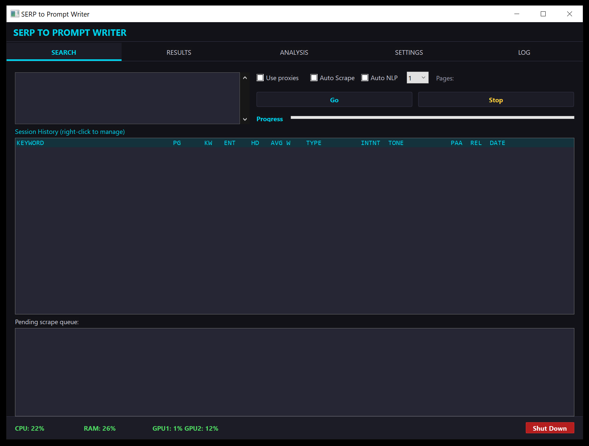
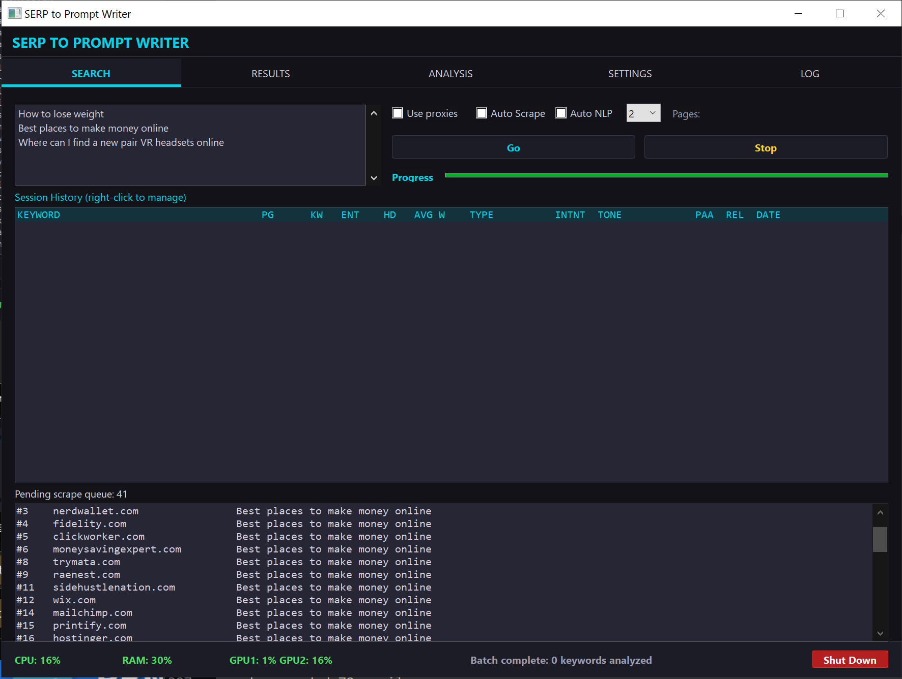
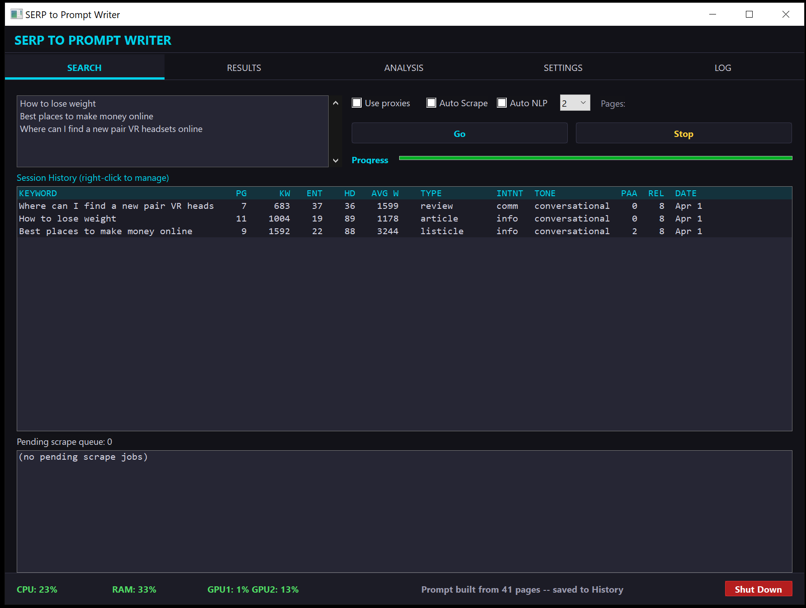
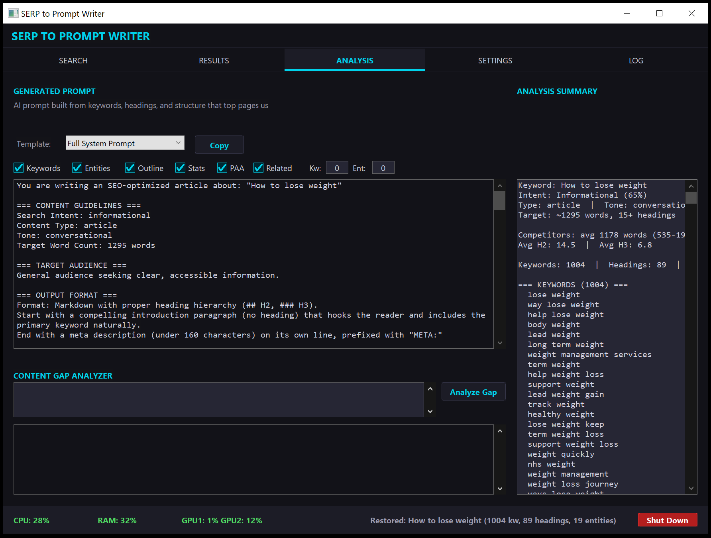
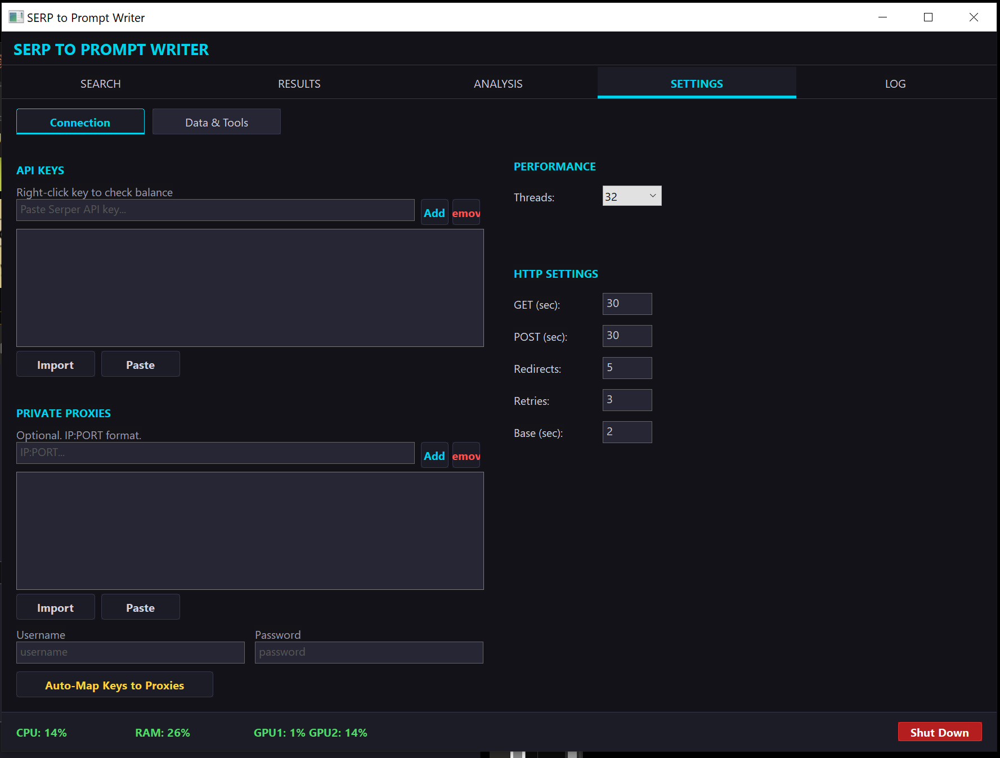
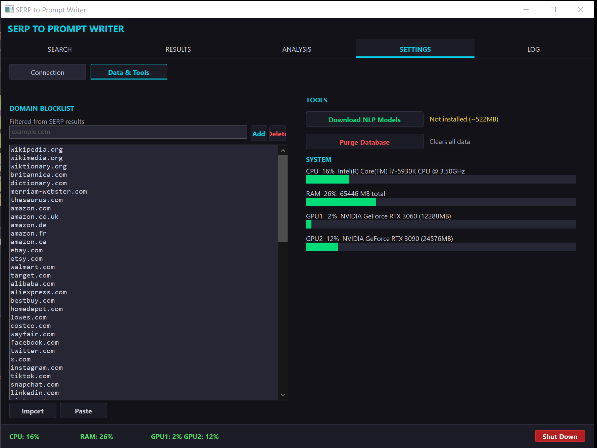

# SERP to Prompt Writer

A Windows desktop application that scrapes Google search results, performs multi-signal NLP analysis on top-ranking pages, and generates optimized AI writing prompts — all from a single keyword.

Built for internet marketers, SEO professionals, and content creators who need data-backed writing briefs instead of generic AI output.



---

## What It Does

1. **Searches Google** via the Serper API for your target keyword (paginated, up to 30 results)
2. **Scrapes top-ranking pages** — extracts full text, headings (H1-H6), outbound links, meta tags, and page structure
3. **Falls back to headless browser** (Chrome/Edge DevTools Protocol) for JavaScript-heavy pages
4. **Runs NLP analysis** on the scraped corpus:
   - TF-IDF keyword extraction with 3-signal rescoring (corpus frequency, BERT semantic similarity, TF-IDF)
   - Named Entity Recognition via ONNX Runtime (bert-base-NER)
   - Search intent classification (informational / commercial / transactional / navigational)
   - Content type detection via zero-shot NLI (distilbart-mnli)
   - Heading pattern analysis across competitors
   - Competitive benchmarks (word count, heading density, link density)
5. **Generates an optimized system prompt** you can paste directly into ChatGPT, Claude, or any AI writing tool

The result: a complete writing brief with target keywords, recommended outline, entity references, word count targets, and structural guidance — all derived from what Google is actually ranking right now.

---

## Screenshots

### Batch Keyword Processing
Enter multiple keywords (one per line) and process them as a concurrent batch. URLs queue up for scraping while Serper API calls continue in parallel.



### Session History
After analysis completes, results are saved to session history with full statistics — keyword count, entity count, heading count, content type, intent, and tone.



### Generated Prompt & Analysis
The Analysis tab shows the generated system prompt alongside a keyword summary panel. Four prompt templates are available: Full System Prompt, Keywords Only, Outline Only, and Competitive Brief. A built-in Content Gap Analyzer lets you paste existing content to find missing keywords and headings.



### Settings — Connection
Configure Serper API keys (with round-robin rotation for multiple keys), private proxies, thread count, and HTTP timeout settings.



### Settings — Data & Tools
Manage the domain blocklist, download ONNX NLP models, purge the database, and monitor system resources (CPU, RAM, GPU utilization).



---

## Key Features

- **Concurrent batch processing** — analyze dozens of keywords in a single run
- **Smart scraping** — HTML-first with automatic JavaScript rendering fallback via Chrome DevTools Protocol
- **3-signal keyword scoring** — Wikipedia frequency ratio + BERT semantic similarity + TF-IDF, weighted and combined
- **Named Entity Recognition** — ONNX-accelerated bert-base-NER extracts people, organizations, locations, and products from scraped pages
- **Zero-shot content classification** — distilbart-mnli classifies content type (how-to, comparison, review, recipe, health guide, listicle, etc.)
- **Intent detection** — heuristic + signal-based classification of search intent with confidence scores
- **4 prompt templates** — Full System Prompt, Keywords Only, Outline Only, Competitive Brief
- **Content Gap Analyzer** — paste your draft to see which competitor keywords and headings you're missing
- **Session history** — save, load, and compare past analyses with full JSON persistence
- **Auto-export** — every analysis automatically saves .json, .md, and .txt to the output directory
- **Resource monitoring** — real-time CPU, RAM, and GPU utilization with 4-level throttling
- **Domain blocklist** — 100+ pre-configured non-competitive domains (Wikipedia, Amazon, Reddit, etc.) with custom additions
- **URL shuffling** — distributes scrape requests across domains to avoid rate limiting
- **Random User-Agent rotation** — rotates browser fingerprints per request
- **Proxy support** — HTTP/HTTPS/SOCKS5 with round-robin rotation and auto-disable on failure
- **Outbound link crawling** — optionally crawl linked pages for deeper corpus analysis
- **Dark theme UI** — custom Win32 GDI interface with DPI scaling

---

## Architecture

~8,000 lines of C11 targeting Windows 10+ (Win32 API). Built with CMake and vcpkg.

### Pipeline

```
Keyword Input
    |
    v
[Phase 1] Serper API ──> Organic results, PAA, Related searches, Knowledge Graph
    |
    v
[Phase 2] Concurrent Scraping ──> HTML (Gumbo parser) + JS fallback (CDP/WebSocket)
    |                               Headings, links, text, meta tags extracted
    v
[Phase 3] NLP Analysis ──> TF-IDF corpus scoring
    |                      3-signal keyword rescoring (WikiFreq + BERT + TF-IDF)
    |                      ONNX NER entity extraction
    |                      NLI content type classification
    |                      Intent classification
    |                      Heading pattern detection
    |                      Competitive statistics
    v
[Phase 4] Prompt Generation ──> 4 templates with keyword/entity/outline integration
    |
    v
[Phase 5] Persistence ──> SQLite session storage + JSON/MD/TXT file export
```

### Module Breakdown

| Module | Lines | Purpose |
|--------|-------|---------|
| `tui.c` | ~8,000 | Win32 GUI — 5 tabs, owner-draw controls, dark theme |
| `nlp.c` | ~3,600 | TF-IDF engine, n-gram extraction, intent classification, junk filtering |
| `engine.c` | ~2,300 | Pipeline orchestrator, batch processing, background threads |
| `database.c` | ~1,700 | SQLite persistence — sessions, URLs, headings, settings |
| `prompt.c` | ~1,600 | 4 prompt templates, markdown/JSON export, gap reports |
| `onnx_nlp.c` | ~1,600 | ONNX Runtime — NER (bert-base-NER), embeddings (all-MiniLM-L6-v2) |
| `nli.c` | ~900 | BPE tokenizer + distilbart-mnli zero-shot classification |
| `scraper.c` | ~950 | Gumbo HTML parser, content extraction, link/heading parsing |
| `js_render.c` | ~800 | Chrome DevTools Protocol via WinHTTP WebSocket |
| `serper.c` | ~200 | Serper API client with pagination |
| `config.c` | ~210 | .env parser, multi-key rotation |
| `threadpool.c` | ~200 | Win32 condition-variable thread pool |
| `resmon.c` | ~350 | CPU/RAM/GPU sampling, NVML dynamic loading |

### Dependencies

| Library | Purpose |
|---------|---------|
| [libcurl](https://curl.se/libcurl/) | HTTP client with proxy and retry support |
| [SQLite3](https://sqlite.org/) | Session and settings persistence |
| [Gumbo](https://github.com/google/gumbo-parser) | HTML5 parsing |
| [cJSON](https://github.com/DaveGamble/cJSON) | JSON serialization |
| [ONNX Runtime](https://onnxruntime.ai/) | ML model inference (NER, embeddings, NLI) |
| [zlib](https://zlib.net/) | HTTP compression |

### NLP Models (optional, ~1.5 GB)

Downloaded on first use via the Settings tab:

| Model | Source | Purpose |
|-------|--------|---------|
| [bert-base-NER](https://huggingface.co/dslim/bert-base-NER) | HuggingFace | Named Entity Recognition |
| [all-MiniLM-L6-v2](https://huggingface.co/sentence-transformers/all-MiniLM-L6-v2) | HuggingFace | Semantic similarity embeddings |
| [distilbart-mnli](https://huggingface.co/valhalla/distilbart-mnli-12-3) | HuggingFace | Zero-shot content classification |

---

## Building from Source

### Prerequisites

- Visual Studio 2022 (or Build Tools) with C11 support
- [CMake](https://cmake.org/) 3.16+
- [vcpkg](https://vcpkg.io/) (for libcurl, SQLite, Gumbo, zlib)
- [ONNX Runtime](https://github.com/microsoft/onnxruntime/releases) 1.17+ (pre-built, placed in `lib/onnxruntime/`)

### Build

```bash
# Install vcpkg dependencies
vcpkg install curl sqlite3 gumbo zlib --triplet x64-windows

# Configure and build
mkdir build && cd build
cmake .. -DCMAKE_TOOLCHAIN_FILE=[vcpkg-root]/scripts/buildsystems/vcpkg.cmake
cmake --build . --config Release
```

The executable is output to `build/Release/serp_to_prompt_writer.exe`.

### Runtime Files

The compiled exe embeds all required data files (user agents, domain blocklist, Wikipedia frequency table) and extracts them automatically on first launch. Only the DLLs need to ship alongside the exe:

```
serp_to_prompt_writer.exe   (1.4 MB — app + embedded data)
onnxruntime.dll             (12.7 MB)
libcurl.dll                 (692 KB)
sqlite3.dll                 (1.3 MB)
zlib1.dll                   (91 KB)
```

Optional GPU acceleration (NVIDIA CUDA):
```
onnxruntime_providers_cuda.dll       (371 MB)
onnxruntime_providers_shared.dll     (23 KB)
onnxruntime_providers_tensorrt.dll   (711 KB)
```

---

## Quick Start

1. Download the latest release
2. Run `serp_to_prompt_writer.exe` — it creates all directories and a template `.env` on first launch
3. Go to **Settings > Connection** and add your [Serper API key](https://serper.dev) (free tier: 100 searches/day)
4. Optionally click **Download NLP Models** on the Settings > Data & Tools tab for entity extraction and semantic scoring
5. Go to the **Search** tab, type a keyword, and click **Go**
6. View the generated prompt on the **Analysis** tab — click **Copy** to paste into your AI writing tool

---

## Output Formats

Every analysis automatically saves three files to `output/<keyword>/`:

- **`.json`** — Full structured data: keywords with scores, entities, headings, stats, SERP results, and all 4 prompt templates
- **`.md`** — Markdown report with keyword tables, heading patterns, competitive metrics, and the generated prompt
- **`.txt`** — Pipe-delimited data format for programmatic parsing

---

## Credits & Acknowledgments

This application was built using the following open-source projects and services:

- **[Serper.dev](https://serper.dev)** — Google SERP API
- **[ONNX Runtime](https://onnxruntime.ai/)** by Microsoft — cross-platform ML inference
- **[bert-base-NER](https://huggingface.co/dslim/bert-base-NER)** by dslim — Named Entity Recognition model
- **[all-MiniLM-L6-v2](https://huggingface.co/sentence-transformers/all-MiniLM-L6-v2)** by sentence-transformers — semantic embedding model
- **[distilbart-mnli](https://huggingface.co/valhalla/distilbart-mnli-12-3)** by valhalla — zero-shot NLI classification
- **[libcurl](https://curl.se/)** by Daniel Stenberg — HTTP client library
- **[SQLite](https://sqlite.org/)** by D. Richard Hipp — embedded database engine
- **[Gumbo](https://github.com/google/gumbo-parser)** by Google — HTML5 parser
- **[cJSON](https://github.com/DaveGamble/cJSON)** by Dave Gamble — lightweight JSON parser
- **[zlib](https://zlib.net/)** by Jean-loup Gailly and Mark Adler — compression library
- **[vcpkg](https://vcpkg.io/)** by Microsoft — C/C++ package manager

Development assisted by [Claude Code](https://claude.ai/code) (Anthropic).

---

## License

This project is provided as-is for personal and commercial use. See individual dependency licenses for third-party components.

---

## Contributing

Bug reports and feature requests are welcome via [GitHub Issues](../../issues).
